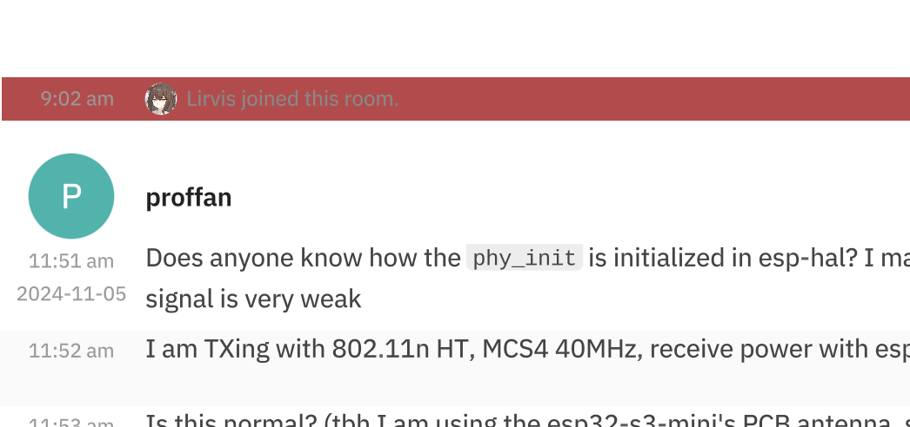

## Ongoing tasks:
- [Apply a yellow background highlight to messages that mention the current user](https://github.com/project-robius/robrix/issues/229)

## Difficulties:
To be honest, there are a large amount of difficulties but I finally almost figuire them out:

- Here is my main idea:
In issue 229 , we don't care the sender `UserId`, instead, only care the receiver `UserId` in a replied event.

Once self `UserId` is equal to the receiver `UserId`, we make a different draw logic to reply message's background.

```
if let Some(mentions) = message.mentions() {
    let client = get_client().unwrap();
    let self_id = client.user_id().unwrap();
    new_drawn_status.mentioned_self = mentions.user_ids.iter().any(|x| x == self_id);
    if new_drawn_status.mentioned_self {
        log!("mentions_self: {}", self_id)
    }
}
```

- related code:
The receiver `UserId`  just in `Mentions`, whose father is `Message` in ruma.
```
pub struct Mentions {
    #[serde(default, skip_serializing_if = "BTreeSet::is_empty")]
    pub user_ids: BTreeSet<OwnedUserId>,

    #[serde(default, skip_serializing_if = "ruma_common::serde::is_default")]
    pub room: bool,
}
```


For this struct, just add a field `mentioned_self` to store if the receiver `UserId` equal to self `UserId`:
```
#[derive(Debug, Default, Clone, Copy, PartialEq, Eq)]
struct ItemDrawnStatus {
    profile_drawn: bool,
    content_drawn: bool,
    mentioned_self: bool,
}
```

## WorkInsights:
At the end of `draw_walk` of `RoomScreen`:
```
let color = vec3(0.7, 0.3, 0.3);
item.as_view().apply_over(cx, live!(
    show_bg: true
    draw_bg: {
        color: (color)
    }
));
item.redraw(cx);
item.draw_all(cx, &mut Scope::empty());
```

The common message is do inside the `RoomScreen`.
However, I don't know why the common message still not can be `apply_over` to red though I forced `apply_over` all the widgets' bg to red



